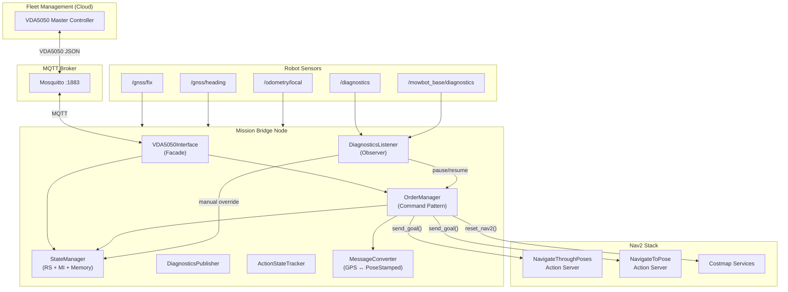
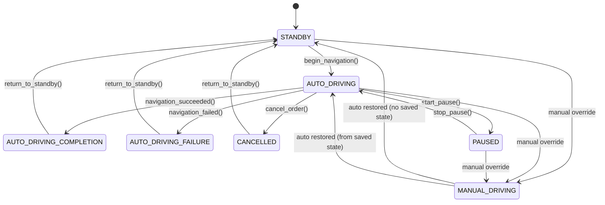

# Mowbot Mission Bridge — Architecture Walkthrough

## Overview

The **Mission Bridge** is a ROS2 Python node (`mission_bridge_node`) that acts as a **protocol translator** between two worlds:

| Side | Protocol | Purpose |
|------|----------|---------|
| **Fleet Management** | VDA5050 v2.0 over MQTT | Receives orders, publishes AGV state |
| **Robot Navigation** | ROS2 Nav2 actions | Sends `NavigateThroughPoses` / `NavigateToPose` goals |

**Package location:** [mowbot_mission_bridge](file:///workspaces/mowbot/src/core/mowbot_sdk/misc/mowbot_mission_bridge)

---

## Architecture Diagram



---

## Component Deep-Dive

### 1. MissionBridgeNode — [mission_bridge_node.py](file:///workspaces/mowbot/src/core/mowbot_sdk/misc/mowbot_mission_bridge/mowbot_mission_bridge/nodes/mission_bridge_node.py)

The **mediator** that wires everything together. Key responsibilities:

- Declares and loads ~30 ROS2 parameters
- Runs an `asyncio` event loop on a background thread (needed because VDA5050 client is async)
- Subscribes to `/gnss/fix`, `/gnss/heading`, `/odometry/local` for position/velocity
- Publishes VDA5050 state at configurable Hz (default 1 Hz)
- Routes incoming VDA5050 orders → `OrderManager.handle_order()`
- Handles instant actions: `cancelOrder`, `emergencyStop`, `startPause`, `stopPause`, `stateRequest`, `resetNav2`
- Periodic Nav2 health polling (2s interval)

> [!IMPORTANT]
> The node uses a **separate asyncio event loop** on a daemon thread. All async operations (MQTT, Nav2 goals) are dispatched via `asyncio.run_coroutine_threadsafe()`. This is critical because `rclpy` and `asyncio` event loops are incompatible.

---

### 2. StateManager — [state_manager.py](file:///workspaces/mowbot/src/core/mowbot_sdk/misc/mowbot_mission_bridge/mowbot_mission_bridge/common/state_manager.py)

Manages **two parallel state machines** plus **universal state memory**:

#### Robot State (RS) — 7 States


#### Mission Info (MI) — 7 States
```
STANDBY → STARTED → ON_PROGRESS → DEST_ARRIVED → END → STANDBY
                   → FAILED → STANDBY
                   → CANCELLED → STANDBY
```

#### State Memory
When manual override occurs, `StateMemory` saves both RS and MI. On auto-restore, it pops the saved state so the mission seamlessly continues.

Key methods:
| Method | RS transition | MI transition |
|--------|--------------|---------------|
| `start_mission()` | — | STANDBY → STARTED |
| `begin_navigation()` | → AUTO_DRIVING | → ON_PROGRESS |
| `navigation_succeeded()` | → AUTO_DRIVING_COMPLETION | → DEST_ARRIVED |
| `navigation_failed()` | → AUTO_DRIVING_FAILURE | → FAILED |
| `cancel_order()` | → CANCELLED | → CANCELLED |
| `return_to_standby()` | → STANDBY | → STANDBY |
| `start_pause()` | AUTO_DRIVING → PAUSED | — |
| `stop_pause()` | PAUSED → AUTO_DRIVING | — |

---

### 3. OrderManager — [order_manager.py](file:///workspaces/mowbot/src/core/mowbot_sdk/misc/mowbot_mission_bridge/mowbot_mission_bridge/common/order_manager.py)

The **mission execution engine**. Implements the full order lifecycle:

#### Order Flow
```
1. handle_order() — validate + accept/reject
2. _execute_order() — async task:
   a. start_mission() (MI=STARTED)
   b. Optional mission_start_delay (safety grace)
   c. reset_nav2() (clear costmaps)
   d. Convert ALL GPS nodes → PoseStamped upfront
   e. Lead-in check: if robot far from Node 1, NavigateToPose to start first
   f. Main loop:
      - Slice remaining poses (all for continuous / one-at-a-time for stop-and-go)
      - begin_navigation() (RS=AUTO_DRIVING, MI=ON_PROGRESS)
      - Wait for Nav2 readiness (15s retry)
      - send_goal() to Nav2
      - Track progress via feedback (background task)
      - Handle manual override pauses, VDA5050 pauses, cancellations
   g. navigation_succeeded() after all nodes
   h. _reset_and_return_to_standby() in finally block
```

#### Two Navigation Modes
- **Continuous** (`navigate_through_poses`): All remaining waypoints sent as a single action
- **Stop-and-Go** (`navigate_to_pose`): One waypoint at a time, sequential

#### VDA5050 State Reporting
`get_vda5050_state_order_kwargs()` builds the complete VDA5050 order state with:
- `orderId`, `orderUpdateId`
- `lastNodeId`, `lastNodeSequenceId` (tracks progress)
- `nodeStates[]` and `edgeStates[]` (echoes order structure)

---

### 4. VDA5050Interface — [vda5050_interface.py](file:///workspaces/mowbot/src/core/mowbot_sdk/misc/mowbot_mission_bridge/mowbot_mission_bridge/common/vda5050_interface.py)

**Facade** around `vda5050.AGVClient`. Handles:

- MQTT connect/disconnect with connection state publishing (ONLINE/OFFLINE)
- `send_state()` — constructs full VDA5050 State message including:
  - Operating mode (`AUTOMATIC`/`MANUAL`)
  - `driving` flag, `paused` flag
  - `agvPosition` (GPS lon/lat + heading)
  - `velocity` (vx, vy, omega)
  - `batteryState`
  - `errors[]` (nav failures + sensor health errors)
  - `information[]` (sensor health OK data)
  - `safetyState` (e-stop)
  - `actionStates[]` (instant action lifecycle)
  - `nodeStates[]`, `edgeStates[]` (from order)
- `send_factsheet()` — retained AGV capabilities message
- Order and instant action callback registration

---

### 5. Nav2Interface — [nav2_interface.py](file:///workspaces/mowbot/src/core/mowbot_sdk/misc/mowbot_mission_bridge/mowbot_mission_bridge/interfaces/nav2_interface.py)

Production Nav2 integration with **dual-mode support**:

| Mode | Action Type | Config Value |
|------|------------|-------------|
| Continuous | `NavigateThroughPoses` | `navigate_through_poses` |
| Stop-and-Go | `NavigateToPose` | `navigate_to_pose` |

Key features:
- **Async rclpy↔asyncio bridge**: `_await_rclpy_future()` wraps rclpy futures for asyncio compatibility
- Progress feedback: distance remaining, poses remaining, navigation time
- Goal cancellation with timeout handling
- Costmap clearing via service clients (`/global_costmap/clear_entirely_global_costmap`, `/local_costmap/clear_entirely_local_costmap`)
- Health monitoring: `is_ready()` polls action server with loss/recovery logging
- Maps Nav2 status codes: `SUCCEEDED(4)→SUCCESS`, `CANCELED(5)→CANCELLED`, `ABORTED(6)→FAILURE`

---

### 6. DiagnosticsListener — [diagnostics_listener.py](file:///workspaces/mowbot/src/core/mowbot_sdk/misc/mowbot_mission_bridge/mowbot_mission_bridge/common/diagnostics_listener.py)

**Observer** on two diagnostic topics:
- `/diagnostics` — sensor health (IMU, LiDAR, GNSS, NTRIP) + battery KV pairs
- `/mowbot_base/diagnostics` — robot base control mode

Monitors:
1. **Control Mode** (manual override). Detected via `status.name == driving_mode_key` or `kv.key == driving_mode_key`. Triggers `transition_to_manual()` / `restore_from_manual()` + order `pause_order()` / `resume_order()`.
2. **Battery** — charge%, voltage, current, charging state from KV pairs
3. **Sensor Health** — tracks `IMU Sensor`, `Laser Scanner`, `NTRIP Client`, `GNSS System` by name match on DiagnosticStatus

---

### 7. MessageConverter — [message_converter.py](file:///workspaces/mowbot/src/core/mowbot_sdk/misc/mowbot_mission_bridge/mowbot_mission_bridge/utils/message_converter.py)

GPS ↔ local coordinate conversion with two methods:

| Method | How | When |
|--------|-----|------|
| `REFERENCE_BASED` | Flat-earth: `x=(lat-ref)*111320`, `y=(lon-ref)*111320*cos(ref)` | Fast, <100km |
| `ROBOT_LOCALIZATION` | `/fromLL` service call | Proper EKF integration |

Also handles `theta ↔ quaternion` conversion.

---

### 8. ActionStateTracker — [action_state_tracker.py](file:///workspaces/mowbot/src/core/mowbot_sdk/misc/mowbot_mission_bridge/mowbot_mission_bridge/common/action_state_tracker.py)

Tracks VDA5050 instant action lifecycle (`RUNNING` → `FINISHED`/`FAILED`). Terminal states pruned after TTL (10s default). Provides `actionStates[]` for VDA5050 state message.

---

## Configuration

Production config: [mission_bridge.params.yaml](file:///workspaces/mowbot/src/mowbot_data/configs/app/mission_bridge.params.yaml)

Key production settings:
- MQTT: `localhost:1883`
- GPS conversion: `robot_localization` (uses `/fromLL` service)
- Nav2: `navigate_through_poses` (continuous mode)
- Mission start delay: `2.0s` (safety grace period)
- Driving mode detection: key=`driving_mode`, manual=`1`, auto=`0`

---

## Data Flow Summary

```
┌─── Inbound ────────────────────────────────────────────────────┐
│ MQTT Order → VDA5050Interface._handle_order()                  │
│   → MissionBridgeNode._on_order_received()                     │
│   → OrderManager.handle_order() [validates, accepts]           │
│   → OrderManager._execute_order() [async task]                 │
│      → MessageConverter.gps_to_pose_stamped() [for each node]  │
│      → Nav2Interface.send_goal(poses)                          │
│      → StateManager.navigation_succeeded/failed()              │
│      → Nav2Interface.reset_nav2() + return_to_standby()        │
└────────────────────────────────────────────────────────────────┘

┌─── Outbound (1 Hz) ───────────────────────────────────────────┐
│ StateManager + GPS + IMU + Odom + Battery + Sensors + Actions  │
│   → VDA5050Interface.send_state()                              │
│   → MQTT → Fleet Management                                   │
└────────────────────────────────────────────────────────────────┘

┌─── Safety ─────────────────────────────────────────────────────┐
│ /diagnostics → DiagnosticsListener                             │
│   → Manual mode detected → StateManager.transition_to_manual() │
│   → OrderManager.pause_order()                                 │
│   → Auto restored → StateManager.restore_from_manual()         │
│   → OrderManager.resume_order()                                │
└────────────────────────────────────────────────────────────────┘
```
